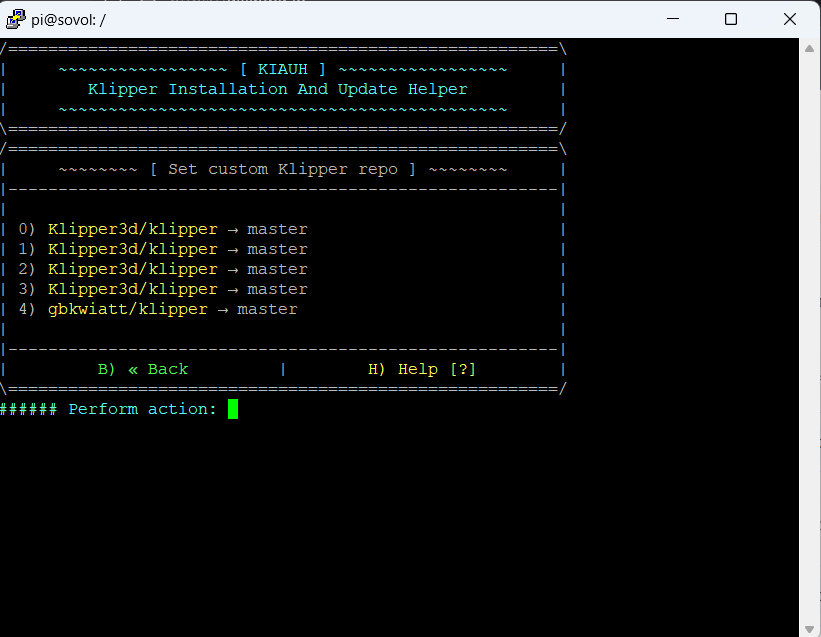
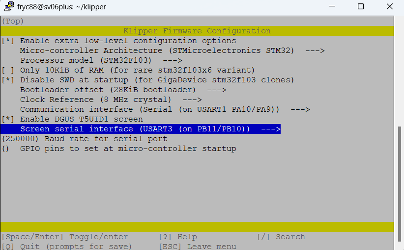

# Sovol SV06 Plus / SV01 Pro stock screen with Klipper

Based on Desuuuu's [DGUS] screen firmware, originally for Creality printers  and  [Desuuuu/klipper] branch, also screen files recreated for T5l1 chip in vertical mode by Tomasz K [gbkwiatt]

This is manual specifically for Sovol SV06 plus printer, however I have successfully used same screen firmware and most of config with SV01 Pro, and it can be used with SV04 as well (but there is another SV04 firmware for IDEX, on SV04 group), so if you want to try on other T5L1 chip based screens - feel free, it might work as well.

# Features

Basic functions that are working fine:
- Preheating, changing temperature during the print, changing fan speed, etc.
- Auto home, manual move X/Y/Z, 
- PID tuning for bed/extruder via screen
- Filament retract/extrude when not printing
- SAVE_CONFIG
- steppers ON/OFF
- some other less important options, like buzzer volume, brightness, etc.

What doesn't work:
- bed mesh via screen
- ETA when printing is bugged
- there is some minor visual glitches within menus

What would be nice to do:
- fix ETA and bed mesh
- add Caselight button

# Start note
I won't be explaining the whole process of how to install and set up Klipper(for now), because it has already been done by others, for example , I will focus on details on how to change branches and get it working with SV06 plus already with Klipper. This firmware is provided without any warranty. You are responsible for your use of it, however I can try to help with some issues.

# Requirements
- Sovol SV06 plus, SV01 pro or similar printer that uses same screen and stock Creality or Sovol board, already with Klipper on it, so it requires some host device too, like Raspberry or Dell Wyse with Mainsail/Fluid + Moonraker
- microSD card, up to 8GB preferred, FAT32 formatted, stock SV06 plus / SV01 pro card works perfect - you will have to reflash BOTH printer's and screen's firmware
- Putty or other way to access host via SSH to make some changes
- WinSCP or other way to access host via SFTP to download compiled firmware (or you can use file precompiled by me ONLY with SV06 plus)
- 2.5mm allen key to open up the screen, it should be attached with the printer when you have purchased it
- basic Linux knowledge, usage of commands, usage of sudo, etc. or ability to search in Google :)
- some time and patience, possibly a coffee or a beer, depending on your preferences, some snack would be nice as well.

# Klipper preparation

You must change you Klipper branch to modified one, stock Klipper does not work (hopefully I can add word 'yet' here), however my friend [gbkwiatt] successfully set his GitHub repository to auto merge with master Klipper branch, so modified branch should stay up to date.

There are a couple of ways to do it, I'll show you only these ways how I have used it, which are kiauh script and mainsail os. You are more likely using one of these two ways, of course you follow only one of them, depending how you have installed your klipper before.

## Option 1 - [kiauh] shell script version
Now it's the time when you have to go back to your host via SSH, same way as you have done to install Klipper originally.

Your config files should be safe, however I advise you to make a backup of your printer.cfg, moonraker.cfg, etc. files before you proceed!

First, you must add Klipper repo to file from kiauh script
```sh
sudo nano ~/kiauh/klipper_repos.txt
```
File more likely does not exist, so you must add this repo at the end of file
```sh
https://github.com/gbkwiatt/klipper
```


To save after making changes you press CTRL + X, it will ask if you want to save a modified buffer and you confirm by pressing Y on the keyboard.

To start script again in most of cases it will be:
```sh
~/kiauh/kiauh.sh
```
Now over there you will probably see some versions installed, etc., it might vary depending on your setup.


Now you press 6 to go to settings:


Then 1 for Custom repository


And select your correct number for gbkwiatt/klipper repository, in my case it is 4, then it will ask if you want to proceed, so you confirm with Y and it will automatically swap repository to correct one for the screen.


And that's it in the script for now, you are already with correct Klipper branch to get the screen working, BUT when you go to your Moonraker GUI, you will see DIRTY/INVALID red message next to Klipper & it will refuse to update - we will sort it in a minute.


## Option 2 - Mainsail OS version

If you have installed the system via Raspberry PI imager as Other specific-purpose OS > 3d printing > Mainsail OS this part is for you.
Your config files should be safe, however I advise you to make a backup of your printer.cfg, moonraker.cfg, etc. files before you proceed!

Now it's the time when you have to go back to your host via SSH, same way as you have done to install Klipper originally.

First, we need to remove the current Klipper folder that contains the master branch - we don't need it.
Full documentation is on KLipper's webpage [here](https://www.klipper3d.org/Installation.html) but I will show the required steps.
First, you need to remove current Klipper version from your system:
```sh
cd ./
ls
```
and make sure klipper is listed there:


Remove it:
```sh
sudo rm -R klipper
```


By default this OS contains git command, if not, you need to install it
```sh
sudo apt update && sudo apt install git
```

Now, you need to pull correct branch of klipper which will take up to few minutes:
```sh
git clone https://github.com/gbkwiatt/klipper
```


After its completed, reboot whole device
```sh
sudo reboot
```
And that's it  for now, you are already with correct Klipper branch to get the screen working, BUT when you go to your Moonraker GUI, you will see DIRTY/INVALID red message next to Klipper & it will refuse to update - we will sort it in a minute.

# Invalid/Dirty version of Klipper
After finishing one of above methods, when you go to your Moonraker, in Machine details you will see this:


We don't want it, because it will prevent us from updating Klipper. Let's solve it.
This part is the same for both previous ways.
Open you SSH yet again, and type this:
```sh
sudo nano ./printer_data/systemd/moonraker.env
```
It will open up a text editor. Line might look different for different ways of installation, also if you have multiple Klipper instances "printer_data" might be named differently, but in most cases above will be correct. You will know if the path is different when it opens the editor - if the file is empty, then it means moonraker.env is stored elsewhere. If you have some content like in the screenshot below, you are good to go.
You need to turn on developer mode in Moonraker, by simply adding -v -g at end of MOONRAKER_ARGS line:


After you finish, to save, press CTRL + X, then confirm with Y. Now you can do a full reboot of the system, or only reload the Moonraker process.
```sh
sudo reboot
```
After reboot, when you open your GUI in the web browser, you must press "Invalid" next to the Klipper version and choose Soft recovery. A while later you will see confirmation and it should turn green Up-to-date again.


Another thing was solved. Now we need some firmware.

# Compiling Klipper firmware for stock mainboard of printer

In order to work, klipper needs to know which UART is being used for the screen, so you need to compile firmware for it. Easy enough. If you don't want to, you can use my pre-compiled file, however it might be helpful in the future to do it on your own.

Go back to SSH and open compilation menu and set everything as on the screenshot below - these settings are correct for SV06 Plus with Sovol board and if i remember right for SV01 Pro with stock Creality board as well, both based on GD32F103 chips:
```sh
cd ./klipper
make menuconfig
```


To save after setting above, press Q to quit, and when prompted press Y to confirm.

Now simply run command to compile firmware (it will take a while, depending of your device, can be up to couple of minutes):
```sh
make
```
You will see something similar at end, most important is last line of it, that means our bin file with klipper has been created successfully:


You need to open SFTP transmission now (via WINSCP for example) to download a bin file to your computer. Use same credentials as for SSH:


Default path will be /home/pi/klipper/out/klipper.bin


Copy it to your computer, wherever you want. You don't need SFTP anymore, you can close it.
This part of the process is the same as for normal Klipper, so you should already know how to do it, you are just flashing different files.
Now, copy file from location to microSD card, I suggest up to 8GB, formatted to FAT32. Filename doesn't matter that much, BUT stock bootloaders on board won't flash the same filename as last time, so if you have named it for example firmware.bin, this time rename it to firmware2.bin or anything else.
Put the microSD card into the printer, switch it on, give it 2-3 minutes, switch it off, remove card, turn printer back on, and now head to your GUI in browser, printer should be there, working again as before.

# Screen firmware
Screen's firmware is pre-built, so you only need to flash it.
Download DWIN_SET.zip from my github and extract it.
Insert your microSD card, same as before - up to 8GB, FAT32 formatted into your computer.
Copy folder DWIN_SET onto the card, it should be only folder on it, containing all files, like on screenshots below:


You are ready to go further.

Switch off printer, unplug and remove screen, then unscrew 4 socket cap screws on the back of screen, carefully take back plate off, release 3 plastic clips on the side and insert microSD card into the reader in the screen.


Connect the screen back, turn on the printer and after a few seconds you will see a blue screen showing files that are being flashed. It might take up to a few minutes, so be patient. As the last step you should see Flash CRC32 check: 000, it means it's done. You can switch off the printer, remove the microSD card from the screen, reinstall the back plate and attach it back to the printer.


All done for now. Now you must tell your Klipper that it's got this fancy screen back and working!

##Screen configuration for Klipper

Head back to your web browser and open your GUI. Printer should be back on and visible there, as I said before. If it is not, something went wrong or you forgot to reboot the host/restart process.

Head to Machine > printer.cfg file. You need to add screen settings there. These parameters are quite correct for SV06 Plus, however I will review it later, just use these for now:
```sh
[t5uid1]
firmware: dgus_reloaded
update_interval: 1
machine_name: Sovol SV06 Plus
#How often to send data updates to the touchscreen.#volume: 75
brightness: 80
#The brightness for the touchscreen (as a value from 0 to 100).
#boot_sound:
#The index of the sound to play when booting. Defaults to being provided by
#the selected firmware.
#notification_sound:
#The index of the sound to play when certain events happened. Defaults to
#being provided by the selected firmware.
x_min_inset: 0
#The distance (in mm) from the minimum X position used by the manual leveling
#screen.
x_max_inset: 300
#The distance (in mm) from the maximum X position used by the manual leveling
#screen.
y_min_inset: 0
#The distance (in mm) from the minimum Y position used by the manual leveling
#screen.
y_max_inset: 300
#The distance (in mm) from the maximum Y position used by the manual leveling
#screen.
x_min: 0
#This can be used to provide a lower limit (in mm) to X moves done using the
#touschreen. Movements will still be limited by your [stepper_x]
#configuration values.
x_max: 300
#This can be used to provide an upper limit (in mm) to X moves done using the
#touschreen. Movements will still be limited by your [stepper_x]
#configuration values.
y_min: 0 #   Same as x_min for the Y axis.
y_max: 300 #   Same as x_max for the Y axis.
z_min: 0 #   Same as x_min for the Z axis.
z_max: 340 #   Same as x_max for the Z axis.
```


Save settings & restart your Klipper.
Your screen should turn from this:


To main home screen:


And now it's nearly finished.

# Screen commands required in start, end and cancel gcode

Screen must get info from Klipper that you have started/ended/cancelled print. There is a couple of ways - if you are using Klipper macros, just add correct commands there. 
It is
> DGUS_PRINT_START

for start


and
> DGUS_PRINT_END

for cancel and end


Your macros might look a bit different, but it doesn't matter, just add it after gcode:, but remember about correct indentation of this command.

If you don't, you can add it in your preferred slicer, similar way as above in Custom Gcode section:


# Happy end
And that's pretty much everything. You are all set, everything should work now. If something is not working, or your Klipper is not starting, then you need to go through all previous steps, to make sure you have done everything. If you got all the way down here, still happy enough, feel free to the use button below :)

[](https://www.buymeacoffee.com/fryc88)

   [DGUS]: <https://github.com/Desuuuu/DGUS-reloaded-Klipper>
   [Desuuuu/klipper]: <https://github.com/Desuuuu/klipper>
   [gbkwiatt]: <https://github.com/gbkwiatt>
   [kiauh]: <https://github.com/th33xitus/kiauh>
